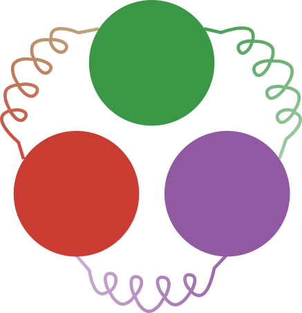

<p align="center">
  
</p>

# ParticleDynamics.jl

[](https://amirabbasi-physics.github.io/ParticleDynamics.jl/dev/)
[](https://github.com/amirabbasi-physics/ParticleDynamics.jl/actions/workflows/ci-cpu.yml)
[](LICENSE)

`ParticleDynamics.jl` is a GPU-native Julia package for particle-based simulations with CUDA, including integrations for MACE and Orb machine-learned interatomic potentials. It provides a high-level workflow API for building a particle system, attaching forces and methods, sampling observables, writing outputs, and running staged simulations without hand-written timestep loops.

The existing low-level engine remains available for expert workflows and tests.
That surface is centered on `build_simulation`, `step!`, integrator builders,
and `ParticleDynamics.SimulationCore`.

## Development version

The working version is **0.2.0-DEV**, which has not been released.
For compatibility changes, see the [changelog](CHANGELOG.md),
[integrator manual](docs/src/manual/integrators.md), and
[force manual](docs/src/manual/forces.md).

## GPU requirement

This package currently targets CUDA-backed simulations.

```julia
using CUDA
CUDA.functional() || error("ParticleDynamics requires CUDA.functional() == true")
```

There is no production CPU simulation backend yet.

## Installation

### Add from a git URL

```julia
using Pkg
Pkg.add(url="https://github.com/amirabbasi-physics/ParticleDynamics.jl")
```

### Develop locally

```julia
using Pkg
Pkg.develop(path="/path/to/ParticleDynamics")
Pkg.instantiate()
```

## Quickstart

The recommended public workflow is:

- `ParticleSystem` holds positions, types, box, masses, velocities, and topology.
- `Group` and `Groups` define particle selections.
- `Force` objects describe interactions.
- `Integrator` owns `dt`, the scheme, attached forces, and methods.
- `Observable` objects compute sampled quantities.
- `Writer` objects own output files and schedules.
- `Stage` describes a named block of running.
- `Simulation` owns the assembled workflow and `run!` owns the timestep loop.

```julia
using ParticleDynamics

N = 128
cfg = hex_random_2d(N, 1.0f0, 0.25f0; T=Float32)
typeids = fill(Int32(1), N)

system = ParticleSystem(
    cfg;
    types=[:A],
    typeids=typeids,
    masses=Dict(:A => 1.0f0),
)

all = Group(:all, AllSelection())
groups = Groups(all)

force = WCA(
    epsilon=10.0f0,
    sigma=1.0f0,
    cutoff=Float32(2^(1 / 6)),
    pairs=:all,
)

integrator = Integrator(
    dt=2.0f-4,
    scheme=VelocityVerlet(),
    forces=[force],
    methods=[Langevin(all; gamma=50.0f0, kT=1.0f0)],
)

thermo = ThermodynamicObservable(all; name=:thermo)

sim = Simulation(
    system;
    groups=groups,
    integrator=integrator,
    observables=[thermo],
    writers=[
        TableWriter(
            "obs.csv";
            every=50,
            observables=[thermo => [:temperature, :kinetic_energy, :potential_energy]],
            mode=:replace,
        ),
        GSDWriter("traj.gsd"; every=200, group=all, write_start=true, mode=:replace),
    ],
    precision=Float32,
    seed=0xC9A319,
)

run!(sim, Stage(:warmup, steps=200; dt=1.0f-4, neighbor_rebuild_interval=1))
reset_observables!(sim)
reset_step!(sim, 0)
run!(sim, Stage(:production, steps=1_000))
```

## Low-level / expert API

The workflow API is the recommended interface for normal scripts and examples.
The following exports are still supported for expert users who want direct
control over GPU buffers and stepping:

- `SimulationState`, `build_simulation`, `step!`, `step_graph!`
- `velocityverlet`, `baoab`, `baoa`, `gsm`, `eulerheun`, `eulermaruyama`, `nosehooverchain`, `csvr`
- `collect_step_observables`, `reset_bath_exchange_accumulators!`
- `gsd_open`, `gsd_close`, `write_gsd_frame!`, `read_gsd_frame!`
- `Filters`, `ParticleGroups`, and `ParticleDynamics.SimulationCore`

Use that surface when you need custom orchestration, kernel debugging, or very
fine-grained control that the workflow facade intentionally hides.

## Machine-learned potentials (MACE, Orb)

The engine can route all force evaluation through an external provider — the
seam that connects it to machine-learned interatomic potentials. A provider
implements one method and attaches to a state:

```julia
struct MyPotential <: AbstractExternalPotential end
ParticleDynamics.external_forces!(pot::MyPotential, st, compute_energy) = ...

attach_external_potential!(st, MyPotential())
step!(st, nve(st; dt), dt)   # all integrators now use the provider
```

[`examples/mace/`](examples/mace) ships a working `MACEPotential` provider
that drives **MACE foundation models** (MACE-MP-0 for materials, MACE-OFF
for organic systems; mace-torch via PythonCall) with the engine's native
integrators — enabling simulations of molecular systems (silicon, liquid
water, organic molecules) with no classical force-field terms. Forces are
validated against the ASE reference implementation to ~1e-14 eV/Å, with NVE
trajectory equivalence to ASE velocity Verlet at the 1e-5 Å level over
hundreds of steps. See [`examples/mace/README.md`](examples/mace/README.md)
for environment setup, the validation suite, and a liquid-water structure
showcase.

[`examples/orb/`](examples/orb) adds a second backend, `OrbPotential`, driving
**Orb-v3 foundation models** (Orbital Materials) behind the same interface,
including the distinction between Orb's `conservative` models (forces as an
energy gradient) and its faster `direct` models (forces predicted
independently, so NVE energy is not conserved). Two independent foundation
models behind one interface turn the engine into a comparison instrument: a
benzene-crystal head-to-head against experimental and CCSD(T) reference data —
lattice energy, equilibrium volume, bond geometry, vibrational spectrum, and
throughput — is in [`examples/orb/README.md`](examples/orb/README.md).

Limitations: external potentials replace *all* internal force terms, require
a bond-free state and `spatial_reorder=false`, and do not provide a virial
(pressure observables are unsupported while attached).

## Examples

Normal examples in [`examples/`](examples) use the high-level workflow API.
[`examples/3D_KG_melt_showcase.jl`](examples/3D_KG_melt_showcase.jl) runs a
canonical Kremer-Grest polymer melt end to end — random-walk chains, gated
soft-core push-off, WCA switch-on ladder, then FENE(k=30, R0=1.5)+WCA
production (`exclude_bonded_pairs=false` lets bonded pairs feel WCA): 100
chains x 32 beads at bead density 0.85 reproduce the KG reference values
(<l> = 0.964, Ree^2/Rg^2 = 6.02, C_inf = 1.73) and write a chain-colored GSD
trajectory with uniform bead diameters.
Helper files beginning with `_` are support code and are not meant to be run
directly.

```bash
julia --project scripts/examples_smoke.jl
```

Optional heavier smoke case:

```bash
NEQSIM_SMOKE_HEAVY=1 julia --project scripts/examples_smoke.jl
```

## Documentation

Hosted documentation:
[amirabbasi-physics.github.io/ParticleDynamics.jl](https://amirabbasi-physics.github.io/ParticleDynamics.jl/dev/)

Build docs locally:

```bash
julia --project=docs -e 'using Pkg; Pkg.instantiate(); include("docs/make.jl")'
```

The docs now distinguish:

- workflow-first onboarding in `docs/src/quickstart.md`
- low-level expert material under `docs/src/manual/`

## Running tests

```bash
julia --project -e 'using Pkg; Pkg.instantiate(); Pkg.test()'
```

## Current limitations

- CUDA is the main supported backend.
- Angles, dihedrals, impropers, electrostatics, and broader force-field terms
  are future work unless explicitly implemented in the current low-level engine.
  For molecular systems, the machine-learned potential path (see
  "Machine-learned potentials" above) sidesteps these terms entirely: the
  MLIP carries the intramolecular chemistry.
- `ForceField` is a future-compatible container, but compiled support is still
  limited to the force families already backed by the existing kernels.
- Bitwise-identical trajectories are not guaranteed across GPUs or toolchains;
  reproducibility should be judged at the statistical level.

## Citation

Please cite this software using metadata in [`CITATION.cff`](CITATION.cff).

## License

This project is distributed under the MIT License. See [`LICENSE`](LICENSE).
