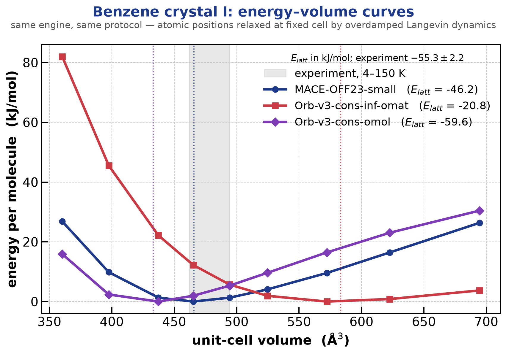
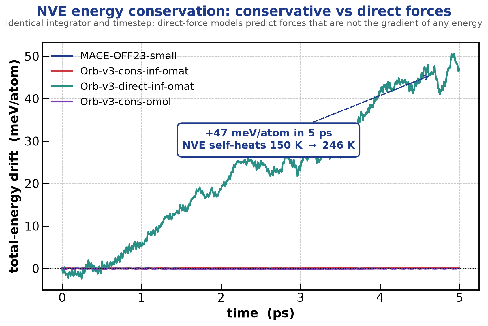
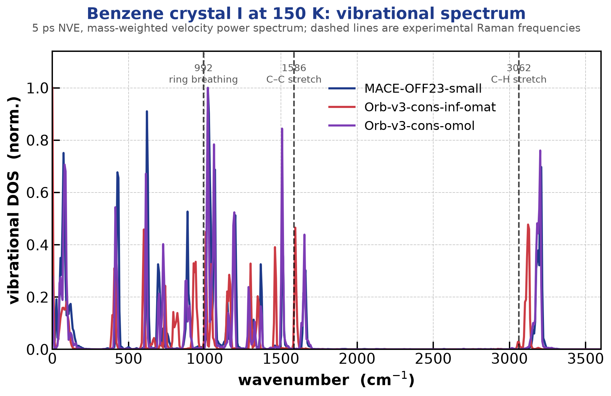
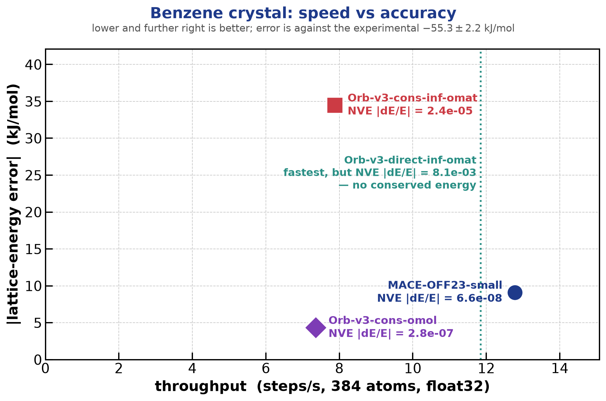

# Orb foundation models, and a head-to-head against MACE-OFF

This directory adds a second machine-learned-potential backend to
ParticleDynamics.jl — **Orb-v3** (Orbital Materials) — behind the same
`AbstractExternalPotential` interface used by the MACE provider in
[`examples/mace`](../mace). With two independent foundation models reachable
through one interface, the engine becomes an instrument for comparing them:
same integrator, same timestep, same relaxation protocol, same GPU, same
process. The only thing that differs between the columns of every table below
is the model call itself.

```julia
include("OrbPotential.jl")

pot = OrbPotential(atomic_numbers, (Lx, Ly, Lz);
                   model="orb_v3_conservative_inf_omat",
                   precision="float32-high")
attach_external_potential!(st, pot)
step!(st, nve(st; dt), dt)
```

The provider mirrors `MACEPotential` deliberately: positions are staged
host-side, forces and energy come back through the model's ASE calculator, and
the engine's force buffers are overwritten. Sharing the staging path is what
makes the comparison fair — any difference in cost or accuracy is the model's,
not the plumbing's.

## What the comparison found

Three results from the benzene-crystal study below, all measured through the
same engine with the same protocol.

Study design, since the choice of checkpoints decides what the comparison
means: the head-to-head is the **domain-matched pair** — MACE-OFF23 and
Orb-v3-`conservative-omol`, both trained on molecules — and Orb's
materials-trained `conservative-inf-omat` is included as a deliberate
**off-domain control**. Conservative variants are used throughout because NVE
requires a conserved energy, and the uncapped (`inf`) neighbour variant is used
so Orb is not handicapped on accuracy.

1. **"Accuracy" is not one number.** The materials-trained Orb model
   under-binds the crystal by a factor of 2.7 (−20.8 vs an experimental
   −55.3 ± 2.2 kJ/mol) and over-expands the cell by ~20% — yet it reproduces
   the *intramolecular* Raman frequencies better than either molecule-trained
   model (+8 cm⁻¹ on the C–C stretch, against −78 for MACE-OFF). Covalent
   stiffness and dispersion cohesion are learned independently. A single
   accuracy score would hide that completely. Note the parameter counts:
   0.69 M for MACE-OFF23-small against 25.5 M for Orb-v3, so the cohesion gap
   runs *against* model capacity by a factor of 37 — it is a training-domain
   effect, not a size effect.
2. **The fastest Orb variant is the one that breaks the physics.** Orb's
   `direct`-force variant is 1.5x faster than its own conservative variant,
   but its forces are not the gradient of any energy: an NVE run started at
   150 K self-heats to a mean of 246 K, drifting +47 meV/atom in 5 ps. The
   three conservative models are flat on the same axes.
3. **The two domain-matched models bracket experiment from opposite sides.**
   MACE-OFF under-binds by 9 kJ/mol and lands the volume inside the
   experimental range; Orb-`omol` over-binds by 4 kJ/mol, putting its cell ~6%
   too dense. Neither is exact and neither wins outright. They also produce
   *nearly identical* frequencies (1021/1508/3202 vs 1021/1508/3209 cm⁻¹) and
   err in the same direction — two unrelated architectures sharing a systematic
   error points at a common limitation of organic-trained MLIPs on these modes,
   which is a more interesting claim than either model "winning".

## What Orb adds that MACE does not

Orb ships two families that behave differently under molecular dynamics, and
the distinction matters more than the speed difference:

| family | forces | consequence |
|---|---|---|
| `conservative` | analytic gradient of a predicted energy | energy is conserved in NVE |
| `direct` | predicted as an independent head | no conserved energy exists |

`direct` models are faster — 1.5x on the 384-atom benzene supercell measured
here (2x in a single-point test on a smaller box). They are also unusable for
NVE, and this directory measures that rather than asserting it (see
*Energy conservation* below).

Orb is additionally a **float32-native** model. `precision="float32-high"`
enables TF32 matmuls; float64 is supported but costs ~30x on a consumer GPU
(the RTX 3090 runs FP64 at 1:64 of FP32). This repo's MACE work runs float64 by
default, so precision is stated explicitly on every timing below.

## Environment

Both model families share one virtual environment on purpose — a head-to-head
is only meaningful if both drivers use the same torch build, the same CUDA
kernels and the same GPU. Setup and the two deliberate deviations from a plain
`pip install orb-models` (a dm-tree pin, and pinning orb-models 0.6.2 because
0.7.0 removed its ASE calculator) are documented in
[`requirements.txt`](requirements.txt).

```bash
julia --project=examples/orb -e 'using Pkg; Pkg.develop(path="."); Pkg.instantiate()'
export PARTICLEDYNAMICS_PYTHON=~/.venvs/pd-mace/bin/python
bash examples/orb/run_showcase.sh      # everything below, in order
```

## Bridge fidelity

`orb_bridge_smoke.jl` pushes positions through the engine's external-potential
path and compares the resulting forces with an independent ASE call on the same
configuration. It runs in **float64** on purpose: that makes the model call
deterministic, so any discrepancy is attributable to the staging path rather
than to TF32 reduction order.

| check | result | criterion |
|---|---|---|
| Orb forces, engine path vs ASE | max\|ΔF\| = 4.1e-15 eV/Å | < 1e-10 |
| Orb energy, engine path vs ASE | \|ΔE\| = 8.5e-14 eV | < 1e-8 |

For scale, the forces themselves are ~3.4 eV/Å. This matches the fidelity of
the MACE bridge (1.6e-15 eV/Å) and confirms the two providers are
interchangeable at the interface.

## Showcase: benzene crystal I vs experiment

Benzene phase I (Pbca, Z = 4, orthorhombic — which is what the engine's box
supports) is one of the best-characterised molecular crystals and a member of
the X23 benchmark set, so experiment and high-level theory both provide
yardsticks. Starting structure: **COD 7238223**, 150 K, ambient pressure
(Nayak, Sathishkumar & Guru Row, *CrystEngComm* **12**, 3112 (2010)). All
reference values and their uncertainties are collected in
[`REFERENCES.md`](REFERENCES.md).

A molecular crystal is a hard test for a foundation model because its cohesion
is almost entirely dispersion — there is no bonding between molecules to lean
on. It is also a domain test: MACE-OFF is trained on organic molecules,
Orb's `omat` models on inorganic materials, and Orb's `omol` model on molecules.

### Energy–volume curves and lattice energy

No barostat is possible here: while an external potential is attached the
engine's provider contract supplies no virial, so pressure observables and NPT
are unsupported. The equilibrium volume is obtained instead from an
energy–volume scan — at each isotropically scaled cell the atomic positions are
relaxed at fixed cell by overdamped Langevin dynamics (BAOAB at T = 0 with
strong friction), which is a minimisation the engine performs natively.
`E_latt = E_crystal/Z − E_monomer`, with the monomer relaxed in a 20 Å box.



| model | training domain | V₀ (ų) | E_latt (kJ/mol) | error vs experiment |
|---|---|---:|---:|---:|
| MACE-OFF23-small | organic molecules | 465 | −46.2 | +9.1 |
| Orb-v3-conservative-omol | molecules (OMol) | 433–437 | −59.6 | −4.3 |
| Orb-v3-conservative-inf-omat | inorganic materials | 572–583 | −20.8 | +34.5 |
| **experiment** (0 K, back-corrected) | — | 462–494 | **−55.3 ± 2.2** | — |
| CCSD(T) | — | — | −55.90 ± 0.76 | — |

Three things come out of this, and none of them is "model X wins":

1. **Training domain dominates.** The materials-trained `omat` model
   under-binds benzene by a factor of 2.7 and over-expands the cell by ~20%.
   OMat24 contains essentially no dispersion-bound molecular crystals, and the
   failure is exactly what that omission predicts — its E(V) curve is nearly
   flat above 570 ų, i.e. it barely binds the crystal at all.
2. **The two in-domain models fail in opposite directions.** MACE-OFF
   under-binds by 9 kJ/mol but puts V₀ at 465 ų, inside the experimental
   range. Orb-`omol` gets the lattice energy closest to experiment but
   over-binds, so its cell is ~6% too small. Geometry and energetics are not
   won by the same model.
3. **The reference data has its own spread.** Experiment and CCSD(T) agree near
   −55 to −56 kJ/mol, but two DMC studies put benzene near −50 kJ/mol, and raw
   experimental sublimation enthalpies scatter over 41.7–53.9 kJ/mol. Claiming
   sub-kJ/mol agreement from an MLIP here would be over-reading the yardstick.

One caveat on the `omat` number specifically: `E_latt` is a difference between
a periodic crystal and an isolated molecule in a 20 Å box, and an inorganic
materials model is out of its domain for *both* — a molecular crystal and a
gas-phase monomer. Its −20.8 kJ/mol therefore mixes two separate
extrapolation failures and should be read as "this model does not describe
this system", not as a calibrated error bar.

Numerical hygiene: the unit-cell and 2×2×2-supercell energies per molecule
agree to **0.008 kJ/mol or better** for every model, so the unit-cell scan is
not size-limited; residual forces after relaxation are ≤ 0.017 eV/Å.

### The C–H bond: correcting an X-ray artifact

The starting structure is an X-ray refinement, and its C–H distance is 0.93 Å —
the standard X-ray foreshortening artifact, since X-rays see electron density
rather than nuclei. Neutron diffraction gives ~1.08 Å. Relaxing under each
potential recovers the nuclear geometry:

| | C–C (Å) | C–H (Å) |
|---|---:|---:|
| X-ray starting structure | 1.379 | 0.930 |
| MACE-OFF23-small, relaxed | 1.389 | **1.081** |
| Orb-v3-cons-omol, relaxed | 1.390 | **1.084** |
| Orb-v3-cons-inf-omat, relaxed | 1.396 | **1.093** |
| experiment (neutron) | ~1.39 | ~1.08 |

All three models correct a 0.15 Å experimental artifact to within 0.013 Å of
the neutron value — including the materials-trained one, which gets the
intramolecular geometry right while failing badly on the intermolecular
binding. Local chemistry and cohesion are learned independently.

### Finite temperature: NVE conservation, and why `direct` models cannot be used

`benzene_md_vdos.jl` relaxes from the X-ray geometry, equilibrates at 150 K with
BAOAB Langevin, then runs 5 ps of NVE while recording velocities every step.
The unit cell (48 atoms) is used, which is ample for the intramolecular modes
compared below.

| model | steps/s | mean T (K) | max \|dE/E\| | drift (eV/step/atom) |
|---|---:|---:|---:|---:|
| MACE-OFF23-small (float64) | 49.0 | 159 ± 13 | 6.6e-08 | −6.2e-10 |
| Orb-v3-cons-omol (float32) | 31.4 | 170 ± 13 | 2.8e-07 | −2.6e-09 |
| Orb-v3-cons-inf-omat (float32) | 44.4 | 146 ± 12 | 2.4e-05 | +9.3e-09 |
| **Orb-v3-direct-inf-omat** (float32) | **57.4** | **246 ± 73** | **8.1e-03** | **+4.7e-06** |



The direct-force model is the fastest of the four — and the only one that
destroys the simulation. Its forces are not the gradient of any scalar, so
there is nothing for the integrator to conserve: total energy climbs
**+47 meV/atom in 5 ps**, and an NVE run initialised at 150 K silently heats
itself to a mean of **246 K with ±73 K excursions**. The three conservative
models stay flat on the same axes. Anyone quoting a direct-force model's
throughput advantage without showing this plot is selling half the story.

Note also that Orb-conservative's drift (2.4e-05) is ~360x MACE's (6.6e-08).
That is not a model defect but the precision difference: Orb runs float32,
MACE float64 here. Orb-`omol` at the same float32 conserves to 2.8e-07, so
architecture matters too.

### Vibrational spectrum vs Raman

The mass-weighted velocity power spectrum from the NVE segment, against the
experimental Raman frequencies of benzene:



| mode | experiment | MACE-OFF23 | Orb-v3-cons-omol | Orb-v3-cons-omat |
|---|---:|---:|---:|---:|
| ring breathing | 992 | 1021 (+29) | 1021 (+29) | **1007 (+15)** |
| C–C stretch | 1586 | 1508 (−78) | 1508 (−78) | **1594 (+8)** |
| C–H stretch | 3062 | 3209 (+147) | 3202 (+140) | **3122 (+60)** |

This is the mirror image of the lattice-energy result: the materials-trained
`omat` model, which fails badly on intermolecular cohesion, reproduces the
*intramolecular* frequencies better than either molecule-trained model. Covalent
stiffness and dispersion binding are learned independently, and a single
"accuracy" number for a foundation model hides that completely.

The direct-force model is deliberately absent from this figure: its NVE segment
did not conserve energy, so its velocities sample a drifting temperature rather
than the 150 K at which the other spectra are measured.

Caveats worth stating: these are classical frequencies from a 5 ps trajectory
(6.7 cm⁻¹ resolution) with no anharmonic or nuclear-quantum corrections, and
the VDOS weights every mode by kinetic energy rather than by Raman activity, so
peak *heights* are not comparable to a measured spectrum — only positions are.

### Throughput

`benzene_throughput.jl` times 200 NVE steps on the 384-atom supercell after 20
warm-up steps, one model per process. Precision is an explicit argument because
it dominates the comparison.

| model | precision | steps/s | ms/step |
|---|---|---:|---:|
| MACE-OFF23-small | float32 | **12.78** | 78.2 |
| Orb-v3-direct-inf-omat | float32-high | 11.85 | 84.4 |
| Orb-v3-cons-inf-omat | float32-high | 7.88 | 126.9 |
| Orb-v3-cons-omol | float32-high | 7.36 | 135.8 |
| MACE-OFF23-small | float64 | 7.35 | 136.1 |

**These rows are not an architecture comparison, and reading them as one would
be wrong.** The two checkpoints differ in size by a factor of 37:

| model | parameters | ms per force call | per-parameter cost |
|---|---:|---:|---:|
| MACE-OFF23-small | 0.69 M | 76.8 | 111 ns/M-param |
| Orb-v3-cons-inf-omat | 25.51 M | 138.4 | 5.4 ns/M-param |
| Orb-v3-direct-inf-omat | 25.64 M | 82.9 | 3.2 ns/M-param |

MACE-OFF23-**small** wins the wall-clock row because it is a deliberately small
network, not because Orb is inefficient: normalised per parameter Orb is ~20x
cheaper. What the table actually says is "these are the costs of the
checkpoints you would download", which is the practically useful statement, and
nothing more.

Other things worth reading off it:

- **Orb's conservative model costs ~1.5x its own direct variant** (7.88 vs
  11.85 steps/s). That is the price of differentiating the energy to get
  forces — and, per the NVE result above, the price of having a conserved
  energy at all. It is worth paying.
- **`torch.compile` is not the explanation.** Orb-v3 is designed to run
  compiled, so the uncompiled numbers above could have been an unfair
  handicap; measured, `compile=True` improves the conservative model by only
  ~6% (138.4 → 130.2 ms), leaving the ordering unchanged.
- **Driver overhead is negligible**, which the two independent measurements
  confirm: MACE costs 76.8 ms as a bare single-point ASE call and 78.2 ms per
  full engine NVE step — ~2% for integration plus host staging.
- **float64 costs MACE 1.7x.** For Orb the penalty is far worse: a single
  force call on a 192-atom periodic box measured 44 ms at `float32-high`
  against 1510 ms at float64 — ~34x, reflecting the RTX 3090's 1:64 FP64
  throughput. Orb is a float32-native model and should be run that way.

A further caution against over-generalising: the ranking is also
system-dependent. On a 192-atom water box, single-point calls came out at 44 ms
for Orb-conservative against 60 ms for MACE-OFF-float32 — the opposite order to
the 384-atom benzene result. Composition, size and checkpoint choice all matter.

The sharper point is what the parameter counts do to the *accuracy* result: a
0.69 M-parameter model describes this crystal's cohesion 2.7x better than a
25.5 M-parameter one. That gap is not capacity, it is training domain.



### Side-by-side movie

`benzene_melt_movie_gsd.jl` runs a CSVR heating ramp on the 384-atom supercell
at matched float32 precision, writing a GSD trajectory plus per-frame
diagnostics; `py_benzene_movie.py` renders the two models side by side with
Fresnel.

The two rendered panels are the **domain-matched pair** — MACE-OFF23 and
Orb-v3-`omol`, both trained on molecules. Rendering the materials-trained
`omat` variant against an organic specialist would be a strawman, so it appears
only in the scorecard, explicitly labelled as an off-domain control.

The figure is built around the experimental comparison rather than the
trajectory. Bottom left is a scorecard carrying **every experimentally
measurable quantity** for benzene crystal I — lattice energy, equilibrium cell
volume, both bond lengths, and three Raman frequencies — with all three models
beside the measured value and the closest emboldened. The pattern it makes is
the result: MACE-OFF takes the geometry rows, Orb-`omol` the cohesion row, and
the off-domain control every frequency row.

Bottom right tracks the mean C–C and C–H bond lengths live as errors against
their measured values, so the zero line *is* experiment (9-frame moving average;
the per-frame mean over 192 bonds is too noisy to read otherwise). Note that the
*intercepts* are model error while the gentle upward *slopes* are physics: bond
anharmonicity shifts a mean bond length outward as the vibrational amplitude
grows, which is the microscopic origin of thermal expansion. Measured over this
ramp, ⟨C–H⟩ grows ~9 mÅ from 150 K to 800 K while ⟨C–C⟩ stays flat to within
±2 mÅ — the aromatic C–C bond is stiffer and pinned by ring closure. Each render
carries a live MD-steps/s badge.

An earlier cut of this figure plotted the thermostat trace and the MSD order
parameter. Both were dropped once measured: the two models disorder at
indistinguishable temperatures, so those panels showed no comparison, only
motion.

```bash
micromamba create -y -p ~/.venvs/pd-fresnel -f examples/kg_fresnel_environment.yml
julia --project=examples/orb examples/orb/benzene_melt_movie_gsd.jl mace-off
julia --project=examples/orb examples/orb/benzene_melt_movie_gsd.jl orb-cons
~/.venvs/pd-fresnel/bin/python examples/orb/py_benzene_movie.py --preview
~/.venvs/pd-fresnel/bin/python examples/orb/py_benzene_movie.py --stride 2
```

The ramp runs 150 K → 800 K, well past benzene's ambient-pressure melting point
of 278.7 K, and that choice needs stating plainly: **the cell is fixed**, because
an external potential supplies no virial and there is therefore no barostat. A
crystal held at its own equilibrium density superheats substantially, so a ramp
stopping near 278.7 K would show nothing happening at all.

What the run actually produces is *progressive* loss of order, not a melting
event: the mean-squared displacement rises smoothly from ~0.8 Ų at 170 K to
11–14 Ų at 780 K, with no discontinuity anywhere. That is the expected
behaviour for a fixed-cell ramp at ~100 K/ps, and it is the reason no melting
temperature is quoted from this run — a first-order transition cannot be
located this way. The 278.7 K line in the figure is drawn purely as an
experimental landmark.

**The ramp does not discriminate the two models, and that is worth recording
as a negative result.** Despite Orb-`omat` under-binding the crystal by more
than a factor of two, the two disordering curves are almost on top of each
other:

| MSD threshold | MACE-OFF23 | Orb-v3-cons-inf-omat |
|---|---:|---:|
| > 1 Ų | 272 K | 182 K |
| > 2 Ų | 301 K | 300 K |
| > 5 Ų | 469 K | 467 K |
| final (780 K) | 14.0 Ų | 11.0 Ų |

At a fixed cell the crystal cannot expand, so how far molecules wander under
heating is set by the imposed density and the ramp rate rather than by the
model's cohesive energy — which is exactly what the missing barostat costs us
here. The lattice energy and equilibrium volume (above) remain the
discriminating observables; this run is not one. What the movie does show
fairly is the live throughput difference at matched precision (12.7 vs
7.7 steps/s on this system) alongside each model's accuracy badge.

A heating ramp at fixed volume is therefore the wrong instrument for
separating these two models. The observable that *does* separate them
dramatically is `conservative` vs `direct` forces under NVE, where the direct
model self-heats 150 K → 246 K while the conservative ones stay flat.

Output: `validation/benzene_head_to_head.mp4` (3200×1800, 8 s at 25 fps with
`--stride 2`). Trajectories, diagnostics and the movie are generated artifacts
and stay out of git; only the figures and the input CIF are tracked.

## How large a system can this actually drive?

`py_scaling_study.py` replicates the 64-molecule water box into k×k×k supercells
and times single-point force calls until each model runs out of memory. Because
the engine adds only ~2% over a bare force call, the model call *is* the step.

RTX 3090 (23.5 GB), float32, cost per atom taken from the linear regime:

| model | largest run | µs/atom | memory/atom | ns/day at that size |
|---|---:|---:|---:|---:|
| MACE-OFF23-small | 12 288 atoms (4 096 H₂O) | 43 | ~0.95 MB | 0.081 |
| Orb-v3-cons-inf-omat | 1 536 atoms (512 H₂O) | 178 | ~5 MB | 0.158 |
| Orb-v3-cons-20-omat | 12 288 atoms (4 096 H₂O) | 43 | ~1.2 MB | 0.081 |
| **Orb-v3-direct-20-omat** | **65 856 atoms (21 952 H₂O)** | **19** | **~0.18 MB** | 0.035 |

Three things follow.

**Cost and memory are both linear in N**, as they should be for message passing
with a fixed cutoff. Orb-direct-20 holds 19.96 → 18.85 → 18.93 µs/atom across a
13x span in system size; MACE holds 43.2 → 42.7 µs/atom. Below ~5 000 atoms the
GPU is underutilised and the per-atom cost is inflated, so small-system timings
must not be extrapolated downward in cost.

**Memory is the binding constraint, and it is dominated by the force route.** The
same Orb architecture needs ~1.2 MB/atom with conservative forces and
~0.18 MB/atom with direct forces — a ~6.5x saving, because a direct model never
builds the autograd graph needed to differentiate an energy. That single choice
is the difference between stopping at 24 000 atoms and reaching 65 856.

**Throughput, not memory, is what makes large-scale MLIP MD pointless here.**
Even the cheapest variant at 65 856 atoms manages 0.035 ns/day — 29 days per
nanosecond. At 12 288 atoms with MACE it is 12 days per nanosecond. These models
are affordable for picoseconds of dynamics on 10³–10⁴ atoms, which is enough for
structure and spectra (the 64-molecule showcase above already reproduces g_OO to
~2%), and unaffordable for anything requiring sampling.

Extrapolating to 30 000 water molecules (98 304 atoms): Orb-direct-20 would need
~18 GB of activations and ~1.9 s/step (~43 days/ns); MACE-OFF-small would need
~90 GB and ~4.2 s/step. The first needs roughly a 32–40 GB card, the second an
80 GB one at minimum. Note the trap: the only variant that gets close is the
`direct` one, which does not conserve energy (see above) — so the variant that
scales is the one you cannot use for constant-energy dynamics.

## Limitations

Inherited from the external-potential contract, and unchanged by this work:

- external potentials replace **all** internal force terms; bond-free states
  and `spatial_reorder=false` are required (enforced at attach time);
- no virial from the provider → no pressure, no NPT (hence the E(V) scan);
- positions round-trip through the host each step; at these sizes model
  inference dominates;
- all PythonCall usage stays on the main Julia thread (GIL).

Specific to Orb:

- loading an Orb checkpoint calls `torch.set_default_dtype` process-wide, so a
  MACE-float64 provider and an Orb-float32 provider must not be built in the
  same process. Every script here therefore takes one model per invocation.
- the `omol` models are charge/spin conditioned and require `charge` and `spin`
  in `atoms.info`; `OrbPotential` exposes these as keyword arguments.
